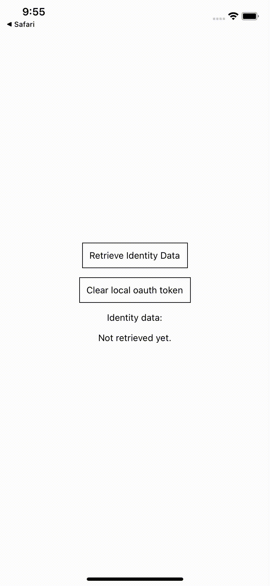

# Discogs OAuth Flow for React Native

A library/example on how to make use of the OAuth flow in React Native in order to access Discogs.com developer API resources. The code itself has no dependencies on any oauth library, the flow was implemented using only plain TypeScript + React Native + Expo.

## How to set up

1. Clone this repository
2. Go to https://www.discogs.com/settings/developers
3. Create a new application
4. Add an application name and hit Save. Once that is done, Discogs will make a consumer key and a consumer secret available for you.
5. Copy those consumer keys and secrets and create an `.env` file in the root of this project with this structure:

```bash
DISCOGS_CONSUMER_KEY=<consumer_key_from_discogs>
DISCOGS_CONSUMER_SECRET=<consumer_secret_from_discogs>
```

6. Open the [discogs config file](discogs.config.json) and add your own appUserAgent (e.g. `MyAwesomeApp/1.0`) and storageAppId (e.g. `@MyAwesomeApp:`)
7. Install npm dependencies
8. Run `npm start` and follow Expo's instructions
9. The result should what is recorded below. It basically shows the identity information of a logged in customer by calling `https://api.discogs.com/oauth/identity`



## How to use the library

The only thing this library exports is a `discogsFetch` function that works similarly to the WHAT-WG `fetch` except that it implements a couple of things under the hood:

1.  If the user is not authenticated into discogs.com, it will start the authentication flow on discogs.com
2.  After the authentication is done, it will redirect to the app and save the authentication token in local storage
3.  It will use the saved tokens to retrieve protected discogs.com API resources for all subsequent requests until the token is expired, when it will go to point 1. again and proceed from there.

Let's say we want to retrieve all the orders of a customer:

```typescript
import { discogsFetch } from './lib/DiscogsOAuth';

(async () => {
  const response = await discogsFetch('marketplace/orders'); // discogsFetch will supply the necessary headers and the api baseUrl
  const jsonData = await response.json(); // That's it! We have retrieved the orders
})();
```
